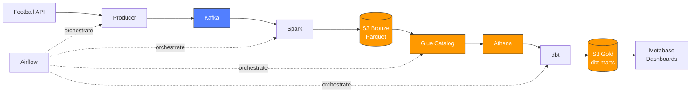

# EPL Realtime Data Pipeline

End-to-end data pipeline for English Premier League match data — from Football API ingestion to BI dashboards, orchestrated by Airflow on a serverless AWS stack.

> **Portfolio project** showcasing modern data engineering practices: streaming (Kafka), batch processing (Spark), lakehouse (S3 + Glue + Athena), transformation (dbt), BI (Metabase), and orchestration (Airflow).


---

## Demo

Full dashboard PDF export: [docs/screenshots/epl_season_overview_dashboard.pdf](docs/screenshots/epl_season_overview_dashboard.pdf)

Four Metabase dashboards on Gold-layer dbt models:
- **League Table 2024/25** — full 20-team standings
- **Points by League Zones** — color-coded by EPL rules (Champions League / Europa / Conference / Midtable / Relegation)
- **Match Results Distribution** — Home 41% / Away 35% / Draw 24% (380 matches)
- **Matchday Activity & Goals** — combo chart of matches + avg goals across 38 matchdays

---

## Architecture



> 📐 For detailed diagrams (sequence, lineage, cost model, failure modes) see [**docs/architecture.md**](docs/architecture.md).

### Data lake layers

| Layer | Storage | Owner | Purpose |
|---|---|---|---|
| **Bronze** | S3 Parquet | Spark | Raw matches/standings from Kafka, partitioned by season/matchday |
| **Silver** | Athena views | dbt (staging) | Deduplicated, type-cast, null-filtered |
| **Gold** | Athena tables | dbt (marts) | Business-ready aggregates with derived columns |

---

## Tech Stack

| Tool | Version | Role |
|---|---|---|
| Apache Kafka | 3.6 | Message broker (3 topics: matches, events, standings) |
| Apache Airflow | 2.8.1 | Orchestration (9-task DAG) |
| Apache Spark | 3.5 | Stream processing (Kafka → Parquet) |
| AWS S3 | — | Data lake (Bronze Parquet, Gold dbt output) |
| AWS Glue Catalog | — | Hive metastore (tables + partitions via boto3 API, no Crawler) |
| AWS Athena | — | Serverless SQL engine |
| dbt-athena-community | 1.8.3 | Silver/Gold transformations, 30 tests, docs generation |
| Metabase | 0.50.20 | BI dashboards via Athena JDBC driver |
| Docker | 24+ | All services containerized |
| Python | 3.11 | Producers, utils, Spark jobs |

---

## Project Structure

```
epl-pipeline/
├── kafka/                      # Kafka broker + Kafka Connect
│   ├── docker-compose.yml
│   └── connectors/             # S3 Sink connector config
├── airflow/                    # Airflow orchestration
│   ├── docker-compose.yml
│   ├── Dockerfile              # Airflow + Spark + isolated dbt venv
│   ├── dags/
│   │   └── epl_s3_pipeline.py  # Main 9-task DAG
│   └── dbt_profiles/           # profiles.yml mounted into container
├── dbt/epl_dbt/                # dbt project
│   ├── models/
│   │   ├── staging/            # Silver: stg_matches, stg_standings
│   │   └── marts/              # Gold: mart_match_results, mart_team_standings
│   └── tests/                  # 30 tests (unique, not_null, accepted_values)
├── spark/                      # Spark standalone (optional)
├── metabase/                   # BI layer
│   ├── docker-compose.yml
│   └── plugins/                # Athena driver .jar (gitignored)
├── src/
│   ├── models/                 # Dataclass: Match, MatchEvent, Standing
│   ├── schemas/                # JSON Schema validation
│   ├── producers/              # Kafka smart producer (real + mock fallback)
│   ├── spark/epl_transformer.py
│   └── utils/                  # api_client, glue_catalog, athena_queries, s3_uploader
├── docs/
│   ├── day27-metabase-dashboard.md
│   └── screenshots/            # Dashboard PDF export
└── test/                       # Unit tests
```

---

## The Pipeline

### Full DAG — `epl_s3_pipeline` (9 tasks)

```
[check_kafka, check_s3]          ← connectivity gates
       │
       ▼
 spark_transform                  ← Kafka → Parquet on S3
       │
       ▼
 verify_s3                        ← count objects per topic
       │
       ▼
 update_glue_catalog              ← register partitions via boto3
       │
       ▼
 data_quality_checks              ← row count, dedup, freshness, schema
       │
       ▼
 dbt_run                          ← Silver views + Gold tables
       │
       ▼
 dbt_test                         ← 30 tests (unique, not_null, accepted_values)
       │
       ▼
 test_athena_analytics            ← league table, home/away stats
       │
       ▼
 pipeline_summary                 ← XCom aggregate, cost report
```

All 9 tasks run green end-to-end.

### dbt Models

| Model | Layer | Materialization | Rows |
|---|---|---|---|
| `stg_matches` | Silver | view | ~380 (deduped with ROW_NUMBER) |
| `stg_standings` | Silver | view | ~20 per snapshot |
| `mart_match_results` | Gold | table | 380 (adds: winner, loser, goal_diff, is_high_scoring) |
| `mart_team_standings` | Gold | table | 20 per season (pre-sorted by rank) |

**Tests:** 30 total — primary key uniqueness, non-null constraints, accepted values for `result`, referential integrity.

---

## Quick Start

### Prerequisites
- Docker Desktop ≥ 24.x
- Python 3.11+
- AWS account with S3 + Glue + Athena access
- [Football API key](https://www.api-football.com/) (free plan works for seasons 2022–2024)

### 1. Clone & configure
```bash
git clone https://github.com/YOUR_USERNAME/epl-pipeline.git
cd epl-pipeline
cp .env.example .env
# Fill in API_FOOTBALL_KEY, AWS credentials, S3 bucket names
```

### 2. Create shared Docker network
```bash
docker network create epl-network
```

### 3. Start services (in order)
```bash
# Kafka + Kafka Connect
cd kafka && docker compose up -d && cd ..

# Airflow (includes Spark + dbt inside container)
cd airflow && docker compose up -d && cd ..

# Metabase (optional, for BI dashboards)
cd metabase && docker compose up -d && cd ..
```

### 4. Access UIs
| Service | URL | Login |
|---|---|---|
| Airflow | http://localhost:8081 | admin / admin |
| Kafka UI | http://localhost:8080 | — |
| Metabase | http://localhost:3000 | set on first run |

### 5. Run the pipeline
Trigger the `epl_s3_pipeline` DAG from Airflow UI, or from CLI:
```bash
docker exec airflow-scheduler airflow dags trigger epl_s3_pipeline
```

---

## Key Design Decisions

### Why Kafka (not direct API → S3)?
Decoupling. Football API rate limits don't bottleneck downstream processing. Kafka's 7-day retention allows replay if consumers fail. Multiple consumers (Spark, monitoring) read the same data independently.

### Why `match_id` as Kafka partition key?
All events for the same match (goals, cards, substitutions) must preserve chronological order. Using `match_id` as the key routes them to the same partition, guaranteeing FIFO per match.

### Why Glue Catalog via boto3, not Glue Crawler?
Crawlers cost ~$0.44/hour per DPU. We know the schema upfront, so registering tables + partitions via `boto3.client('glue').create_partition()` is **free** and deterministic. We found and fixed a bug where `setup_all()` was cross-contaminating partitions between tables — having direct control over the API made this debuggable.

### Why dbt on Athena (instead of Redshift)?
AWS free tier blocks Redshift Serverless (SubscriptionRequiredException). Pivoted to `dbt-athena-community` — cheaper (<$0.01/run), reuses existing S3 + Glue, and dbt lineage/tests/docs work identically.

### Why isolated venv for dbt inside Airflow container?
`dbt-athena-community` has hard dependency conflicts with Airflow 2.8.1 (protobuf, boto3, providers-amazon). Solution: install dbt in `/opt/dbt-venv`, symlink `/usr/local/bin/dbt` so `BashOperator` can call `dbt run` without seeing the venv. Airflow's own deps stay pinned.

### Why Metabase (not Superset/Tableau)?
- **OSS + self-hostable** (unlike Tableau)
- **1 container** vs Superset's Redis + Celery + multi-service stack
- Athena community driver stable on v0.50.x
- Fast enough for portfolio demo, metadata in its own Postgres (isolated from Airflow's)

### S3 partitioning strategy
Bronze partitioned by `season/matchday` (for matches) and `season/snapshot_date` (for standings). Enables Athena partition pruning: `WHERE season='2024/25' AND matchday=5` scans ~10KB instead of the whole bucket.

### Standings idempotency limitation
Football API does not support historical `date` parameter on standings endpoint. Workaround: store both `timestamp` (API call time) and `snapshot_date` (`context['ds']`) so downstream queries can distinguish fetch time from pipeline execution date.

---

## Observability & Quality

- **Data Quality checks** (pre-dbt): row counts per topic, duplicates, freshness (max age ≤ 7 days), schema conformance
- **dbt tests**: 30 tests cover uniqueness, null constraints, accepted values
- **Cost tracking**: Athena queries log `bytes_scanned` per query; pipeline summary reports total cost
- **Airflow XCom**: each task pushes metrics (S3 object count, DQ pass/fail, Athena cost) into `pipeline_summary`

---

## Known Limitations

| Area | Limitation | Workaround |
|---|---|---|
| Football API | Free plan: seasons 2022–2024 only | Upgrade to paid for live 2025/26 |
| Standings | No historical backfill by date | Store `timestamp` + `snapshot_date` |
| Live matches | Season 2024/25 ended | Producer runs in mock-data mode |
| Kafka | Single broker, RF=1 | Production: 3+ brokers, RF=3 |
| Secrets | `.env` file (local) | Production: AWS Secrets Manager |

---

## Interview Talking Points

**Q: Why this architecture vs. managed services (Fivetran + Snowflake)?**
Cost control + learning. Serverless AWS stack (S3 + Glue + Athena) runs <$1/month vs. Snowflake's ~$25/credit. For a portfolio project, self-hosted also demonstrates infra understanding — how partitioning, catalog management, and columnar formats affect cost.

**Q: How do you handle late-arriving data?**
Kafka's 7-day retention gives consumers time to catch up. For Spark, watermarking could handle late events (not currently implemented — single batch per matchday). dbt incremental models with `unique_key` would dedup on reprocessing.

**Q: What surprised you during development?**
The Glue partition cross-contamination bug. `setup_all()` was registering `standings/snapshot_date=...` paths as partitions of the `matches` table because I was passing a shared `s3_base` to both calls. The matches table ended up with 20 phantom NULL rows. Caught it by running `SELECT "$path" FROM matches WHERE matchday IS NULL` — the paths pointed to the wrong folder. Fix: separate subpaths per table. Lesson: even "free" metadata needs integration tests.

**Q: Why Home Win is down to 41% in EPL 2024/25?**
Historical EPL avg is ~45–47% home wins. This season shows 41% / 35% / 24% — away wins are 5–7 pp above historical average. Possible drivers: tighter away tactics post-Pep era, fatigue from expanded UEFA formats, or statistical noise. I added this as a dashboard insight to show I read the numbers, not just build the pipeline.

**Q: What would you change for production?**
1. Replace docker-compose with Kubernetes (EKS) + Helm charts
2. Terraform for S3/Glue/IAM (planned Day 31 of this roadmap)
3. Schema Registry + Avro instead of JSON Schema
4. CDC from Postgres instead of API polling (if upstream allowed)
5. dbt incremental models + snapshots for SCD Type 2 on standings
6. GitHub Actions CI: dbt build + Python lint on every PR
7. Alerting (PagerDuty/Slack) on DAG failure or DQ check fail

---

## Roadmap

- [x] **Phase 1 — Kafka** (Days 1–12): broker, producers, schema validation, Kafka Connect → S3
- [x] **Phase 2 — Airflow** (Days 15–19): DAGs, hooks, operators, dynamic DAGs, error handling
- [x] **Phase 3 — AWS + Spark** (Days 20–23): S3, Glue, Athena, Spark transformer, DQ checks
- [x] **Phase 4 — dbt** (Days 24–26): Silver + Gold models, 30 tests, docs, Airflow integration
- [x] **Phase 5 — BI** (Day 27): Metabase dashboards on Gold layer
- [ ] **Day 28** — README polish + architecture diagram (this document)
- [ ] **Day 29** — Demo video (5–10 min walkthrough)
- [ ] **Day 30** — GitHub Actions CI (dbt test + Python lint on PR)
- [ ] **Day 31** — Terraform IaC (S3 + Glue + IAM)
- [ ] **Day 32** — Final polish + retrospective blog post

---

## License

MIT

## Contact

Built as a learning/portfolio project. Feedback welcome — open an issue or reach out.
