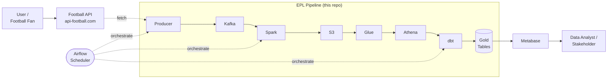
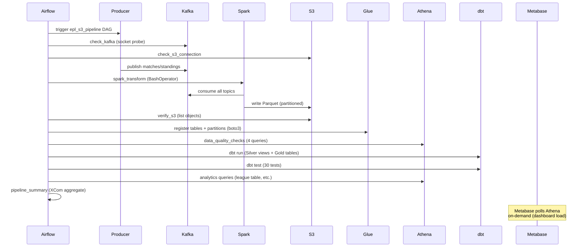
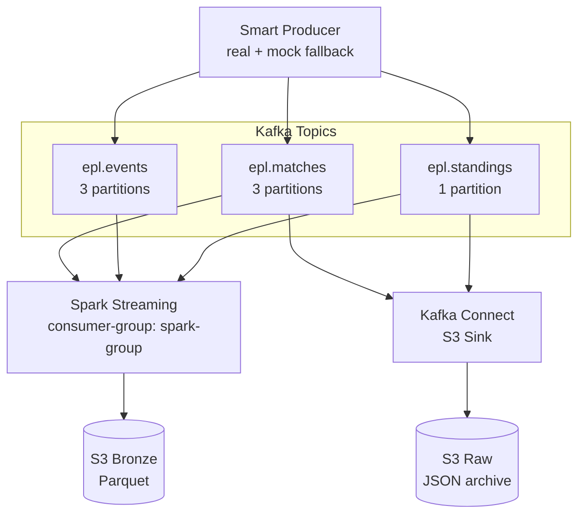
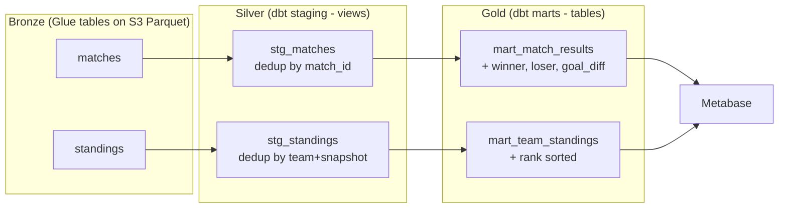
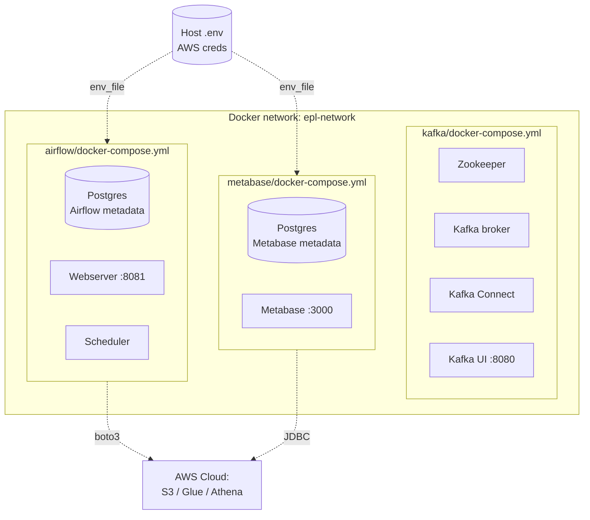

# Architecture Deep Dive

Supplement to the main [README](../README.md) — detailed diagrams and design rationale for interviewers and contributors.

---

## 1. System Context



**Boundaries:**
- **Upstream:** Football API (rate-limited, free tier for 2022–2024 seasons)
- **Downstream:** Metabase dashboards, on-demand Athena queries
- **Orchestration:** Airflow triggers the entire batch pipeline; Kafka Connect streams independently

---

## 2. Data Flow — One Pipeline Run



---

## 3. S3 Layout

```
s3://epl-pipeline-raw-nqh/              ← Kafka Connect raw sink (streaming)
└── raw/
    ├── topics/epl.matches/
    │   └── year=YYYY/month=MM/day=DD/hour=HH/
    └── topics/epl.standings/
        └── year=YYYY/month=MM/day=DD/

s3://epl-pipeline-processed-nqh/        ← Main data lake
├── processed/epl/                      ← Bronze (Spark output)
│   ├── matches/
│   │   └── season=2024%2F25/matchday=1..38/part-*.parquet
│   └── standings/
│       └── season=2024%2F25/snapshot_date=YYYY-MM-DD/part-*.parquet
├── dbt/                                ← Gold (dbt materializations)
│   ├── mart_match_results/
│   └── mart_team_standings/
└── athena-results/                     ← Athena query output staging
```

### Partitioning strategy

| Table | Partition keys | Rationale |
|---|---|---|
| `matches` | `season`, `matchday` | Queries always filter by season; matchday ~10 files per partition = good parallelism |
| `standings` | `season`, `snapshot_date` | Snapshot over time; daily granularity supports historical analysis |

**URL encoding gotcha:** `2024/25` → `2024%2F25` in S3 paths. Hadoop/Spark handles this transparently, but direct `boto3` partition registration needs `urllib.parse.unquote()` to avoid double-encoding (`%252F`).

---

## 4. Kafka Topology



**Partition key choice:**
- `epl.matches`, `epl.events` → key = `match_id`. All events for the same match land on the same partition → ordered processing.
- `epl.standings` → no key (snapshot of full table); 1 partition since ordering across teams doesn't matter.

---

## 5. dbt Lineage



**Materialization strategy:**
- Staging = **views** (cheap, always fresh, dedup happens at query time)
- Marts = **tables** (Parquet in S3 via `dbt-athena-community`, fast for dashboards)

**Test coverage:**

| Test type | Count | Example |
|---|---|---|
| `unique` | 3 | `mart_team_standings.rank` unique per season |
| `not_null` | ~15 | All FK-like columns + scores |
| `accepted_values` | 2 | `result IN ('home_win','away_win','draw')` |
| Custom | 10 | goal_diff sign consistency, points range 0–114 |

---

## 6. Airflow DAG Structure

Task dependencies with TriggerRule annotations:

```
check_kafka     check_s3            (parallel, ALL_SUCCESS required)
        \     /
         spark_transform            (BashOperator → spark-submit)
              │
         verify_s3                  (XCom: s3_object_count)
              │
         update_glue_catalog        (boto3: create_partition per subfolder)
              │
         data_quality_checks        (4 checks, soft-fail with warning log)
              │
         dbt_run                    (BashOperator → /opt/dbt-venv/bin/dbt)
              │
         dbt_test                   (30 tests, hard-fail)
              │
         test_athena_analytics      (3 queries: count, H/A stats, top 5 table)
              │
         pipeline_summary           (XCom aggregate + cost report)
```

**Failure handling:**
- `retries=2`, `retry_delay=3m` at DAG level
- DQ checks log warnings but don't fail (data issues get surfaced, pipeline continues)
- dbt_test fails hard → blocks analytics downstream
- `on_failure_callback` could email/Slack (not wired in current demo)

---

## 7. Deployment Topology (Local Demo)



**Why 3 separate docker-compose files?**
Each stack evolves independently (Kafka has 4 services, Airflow needs a Postgres + Fernet key, Metabase has its own Postgres). Separate files = independent `docker compose down` without tearing down unrelated services. Shared `epl-network` (external) lets them communicate by container name.

---

## 8. Cost Model (AWS)

Rough estimate per full pipeline run on ~1 season of data (~5MB Parquet):

| Service | Operation | Cost |
|---|---|---|
| S3 | Storage (Bronze + Gold) | ~$0.0001/month for 10MB |
| S3 | PUT requests (Spark writes) | ~$0.0001 per run |
| Glue | Catalog (first 1M objects free) | $0 |
| Athena | DQ checks (~5 queries × 1MB) | ~$0.00003 |
| Athena | dbt run (compile + DDL) | ~$0.0001 |
| Athena | Dashboard queries (4 × ~0.5MB) | ~$0.00001 |
| **Total** | **Per pipeline run** | **< $0.001** |

Full month of daily runs + dashboard usage: **under $0.05**. This is the core appeal of serverless lakehouses for portfolio/small-scale work.

---

## 9. Lessons Learned

### Bug: Glue partition cross-contamination (Day 24)
`glue_catalog.setup_all()` was calling `add_partitions(s3_base)` for both `matches` and `standings` tables. Because both tables live under the same `processed/epl/` prefix, Glue discovered `standings/snapshot_date=...` paths and registered them as `matchday` partitions on the **matches** table. Result: 20 phantom NULL rows with `matchday='2026-04-14'` in `SELECT * FROM matches`.

**Detection:** `SELECT "$path" FROM matches WHERE matchday IS NULL` returned paths pointing to `standings/` folder.

**Fix:** Pass subpath per table — `add_partitions("matches", f"{base}/matches/")` and `add_partitions("standings", f"{base}/standings/")`.

**Takeaway:** Even "free" metadata operations need integration tests. A simple `SELECT COUNT(*)` expecting 380 would have caught this.

### Bug: `.gitignore` inline comments (Day 27)
Pattern `**/.user.yml       # comment` doesn't work — Git doesn't strip trailing comments from patterns, so it tried to match the literal string `**/.user.yml       # comment`. Fix: comments on their own line only.

**Takeaway:** `git check-ignore -v <file>` is the authoritative answer to "is this file ignored?"

### Dep hell: dbt-athena + Airflow 2.8.1 (Day 26)
Three-way conflict on `protobuf`, `boto3`, `apache-airflow-providers-amazon`. Any resolution order broke one party.

**Solution:** install dbt in an isolated venv (`/opt/dbt-venv`), symlink the binary to `/usr/local/bin/dbt`. Airflow's Python env stays pinned, dbt's env is independent, BashOperator just calls `dbt` via PATH.

**Takeaway:** When deps can't be reconciled, process isolation is cheaper than version archaeology.
