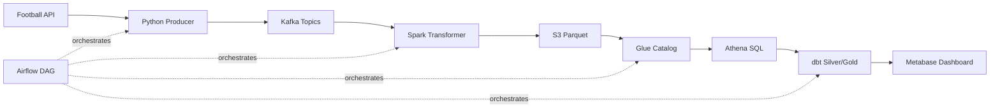

# EPL Pipeline Learning Guide

Tài liệu này dành cho người đã biết lập trình cơ bản và muốn học toàn bộ tech stack trong project `epl-pipeline` theo hướng đi phỏng vấn: hiểu công cụ, hiểu vì sao dùng, đọc được code, giải thích được trade-off.

Mục tiêu không phải học thuộc tên công nghệ. Mục tiêu là trả lời được:

- Dữ liệu đi từ đâu đến đâu?
- Mỗi công cụ giải quyết vấn đề gì?
- Code trong project đang dùng công cụ đó như thế nào?
- Tại sao code theo cách này?
- Nếu nhà tuyển dụng hỏi "sao không dùng cách khác?", mình trả lời ra sao?

> Trạng thái project hiện tại: MVP chính là `matches` + `standings`. Phần `events` từng được làm end-to-end ở Day 29 nhưng đã revert và đưa vào `docs/future-work.md`.

---

## 0. Bức Tranh Tổng Thể

### 0.1. Project Này Là Gì?

Project là một data pipeline cho dữ liệu English Premier League.

Nói đơn giản:

1. Lấy dữ liệu bóng đá từ Football API.
2. Đẩy dữ liệu vào Kafka để làm hàng đợi trung gian.
3. Spark đọc dữ liệu từ Kafka, làm sạch và ghi Parquet lên S3.
4. Glue Catalog đăng ký schema/table để Athena query được.
5. Athena chạy SQL trên dữ liệu S3.
6. dbt tạo tầng Silver/Gold cho analytics.
7. Metabase đọc Gold tables để dựng dashboard.
8. Airflow điều phối toàn bộ các bước.

### 0.2. Luồng Dữ Liệu Chính



### 0.3. Cách Đọc Project Theo Một Record

Ví dụ một trận Arsenal vs Chelsea:

1. API trả về raw fixture JSON.
2. `src/utils/football_api.py` gọi endpoint Football API.
3. `src/utils/api_mapper.py` map JSON API thành object `Match`.
4. `src/models/epl_models.py` định nghĩa dataclass `Match`.
5. `src/utils/kafka_utils.py` validate JSON schema rồi gửi Kafka.
6. Kafka lưu message trong topic `epl.matches`.
7. `src/spark/epl_transformer.py` đọc topic `epl.matches`.
8. Spark parse JSON, thêm `total_goals`, `result`, deduplicate.
9. Spark ghi Parquet lên S3 theo partition `season/matchday`.
10. `src/utils/glue_catalog.py` tạo Glue table và partition.
11. `src/utils/athena_queries.py` chạy DQ/analytics SQL.
12. `dbt/epl_dbt/models/staging/stg_matches.sql` tạo Silver view.
13. `dbt/epl_dbt/models/marts/mart_match_results.sql` tạo Gold table.
14. Metabase đọc Gold table để hiển thị chart.

### 0.4. Tư Duy Data Engineering Cốt Lõi

Trong app backend thường gặp:

```text
request -> service -> database -> response
```

Trong data engineering thường gặp:

```text
source -> ingestion -> queue/storage -> transform -> catalog -> query -> model -> dashboard
```

Điểm khác biệt:

- Dữ liệu có thể đến trễ.
- Dữ liệu có thể trùng.
- Dữ liệu có thể sai schema.
- Pipeline có nhiều bước, mỗi bước có thể fail.
- Chi phí query/storage là một phần của thiết kế.
- Không chỉ cần code chạy, mà cần dữ liệu đúng, query được, replay được, monitor được.

---

## 1. Python Trong Project

### 1.1. Lý Thuyết

Python trong project đóng vai trò glue language:

- Gọi API.
- Map data.
- Validate schema.
- Produce message vào Kafka.
- Tạo Glue tables bằng boto3.
- Gọi Athena queries bằng boto3.
- Viết Airflow tasks.

Python không phải nơi làm heavy transformation lớn nhất. Việc transform dữ liệu lớn được giao cho Spark/dbt.

### 1.2. Code Project

Các file chính:

- `src/models/epl_models.py`
- `src/utils/football_api.py`
- `src/utils/api_mapper.py`
- `src/utils/kafka_utils.py`
- `src/utils/s3_uploader.py`
- `src/utils/glue_catalog.py`
- `src/utils/athena_queries.py`

### 1.3. Dataclass Là Gì?

Trong `src/models/epl_models.py`, project dùng:

```python
@dataclass
class Match:
    match_id: str
    home_team: str
    away_team: str
    home_score: int
    away_score: int
    status: str
    matchday: int
    season: str
    venue: str
    timestamp: str
```

Dataclass giúp:

- Định nghĩa rõ object có field gì.
- Tự sinh constructor.
- Dễ convert sang dict bằng `asdict`.
- Dễ serialize thành JSON.

Trong project:

```python
def to_json(self) -> bytes:
    return json.dumps(asdict(self)).encode("utf-8")
```

Kafka producer cần `bytes`, nên object được convert:

```text
Match object -> dict -> JSON string -> bytes -> Kafka
```

### 1.4. Tại Sao Không Dùng Dict Luôn?

Dùng dict:

```python
match = {
    "match_id": "123",
    "home_team": "Arsenal",
}
```

Vấn đề:

- Dễ typo key.
- Không rõ object cần field nào.
- IDE khó autocomplete.
- Refactor khó hơn.

Dùng dataclass:

```python
match = Match(match_id="123", home_team="Arsenal", ...)
```

Lợi ích:

- Code đọc rõ hơn.
- Field được gom lại thành một contract nhẹ.
- Test serialization dễ hơn.

### 1.5. Tại Sao Không Dùng Pydantic?

Pydantic mạnh hơn dataclass vì:

- Validate type runtime.
- Parse nested data tốt.
- Error message đẹp.

Nhưng project hiện dùng JSON Schema cho validation trước Kafka. Nếu thêm Pydantic nữa thì có thể bị duplicate logic:

```text
Pydantic validation + JSON Schema validation
```

Với portfolio project nhỏ, dataclass + JSON Schema là đủ.

Production có thể cân nhắc:

- Pydantic cho app/API boundary.
- Avro/Protobuf + Schema Registry cho Kafka boundary.

### 1.6. Câu Hỏi Phỏng Vấn

**Hỏi: Tại sao dùng dataclass cho `Match`, `MatchEvent`, `Standing`?**

Trả lời:

> Em dùng dataclass để định nghĩa model nội bộ rõ ràng hơn dict thuần. Nó giúp code producer/mapper dễ đọc, có cấu trúc field cố định, và dễ serialize sang JSON bằng `asdict`. Validation schema vẫn đặt ở JSON Schema trước khi gửi Kafka để đảm bảo message contract ở boundary.

**Hỏi: Nếu API trả thiếu field thì sao?**

Trả lời:

> Mapper trong `api_mapper.py` dùng `try/except` để bắt `KeyError`, `TypeError`, `ValueError`. Nếu mapping fail thì log lỗi và return `None`, producer sẽ bỏ qua record đó thay vì gửi dữ liệu bẩn vào Kafka.

**Hỏi: Tại sao timestamp dùng ISO string chứ không datetime object?**

Trả lời:

> Vì message cần serialize thành JSON để gửi Kafka. JSON không hỗ trợ datetime object trực tiếp, nên dùng ISO string ở ingestion boundary. Sau đó Spark parse lại thành `TimestampType` qua `to_timestamp`.

---

## 2. JSON Schema Và Data Contract

### 2.1. Lý Thuyết

Data contract là hợp đồng giữa producer và consumer.

Nếu producer gửi:

```json
{
  "match_id": "123",
  "home_score": 2
}
```

Consumer cần biết:

- Field nào bắt buộc?
- Type là gì?
- Giá trị hợp lệ là gì?
- Có cho phép field lạ không?

JSON Schema trả lời các câu đó.

### 2.2. Code Project

File:

- `src/schemas/epl_schemas.py`
- `src/utils/kafka_utils.py`
- `test/test_schema.py`

Ví dụ trong `MATCH_SCHEMA`:

```python
"required": [
    "match_id", "home_team", "away_team",
    "home_score", "away_score", "status",
    "matchday", "season", "venue", "timestamp"
],
"properties": {
    "home_score": {"type": "integer", "minimum": 0},
    "status": {"type": "string", "enum": ["scheduled", "live", "finished"]},
    "matchday": {"type": "integer", "minimum": 1, "maximum": 38}
},
"additionalProperties": False
```

Ý nghĩa:

- `required`: thiếu field thì reject.
- `type`: sai kiểu thì reject.
- `minimum/maximum`: giới hạn giá trị.
- `enum`: chỉ cho phép một số trạng thái.
- `additionalProperties: False`: không cho field lạ.

### 2.3. Validate Trước Khi Gửi Kafka

Trong `src/utils/kafka_utils.py`:

```python
def validate_message(topic: str, value: bytes) -> tuple[bool, str]:
    schema = TOPIC_SCHEMAS.get(topic)
    data = json.loads(value.decode("utf-8"))
    validate(instance=data, schema=schema)
```

Flow:

```text
producer tạo JSON -> validate schema -> nếu valid gửi Kafka -> nếu invalid đưa DLQ
```

### 2.4. Tại Sao Validate Trước Kafka?

Nếu không validate:

- Kafka sẽ chứa dữ liệu bẩn.
- Spark parse lỗi hoặc tạo null.
- Glue/Athena query ra dữ liệu sai.
- dbt test fail ở cuối pipeline.

Validate trước Kafka giúp fail sớm:

```text
bad message rejected early -> downstream cleaner
```

### 2.5. Tại Sao Vẫn Cần dbt Tests Nếu Đã Có JSON Schema?

Vì JSON Schema kiểm tra từng message lúc producer gửi.

dbt tests kiểm tra bảng sau transform:

- Có duplicate sau nhiều lần chạy không?
- Có null sau Spark parse không?
- Có accepted values sau transformation không?
- Gold model có đúng business rule không?

Hai lớp kiểm tra khác nhau:

```text
JSON Schema = message-level contract
dbt tests = table/model-level quality
```

### 2.6. Câu Hỏi Phỏng Vấn

**Hỏi: JSON Schema khác gì database schema?**

Trả lời:

> JSON Schema validate message JSON trước khi vào Kafka. Database/Glue schema mô tả cấu trúc table để query dữ liệu đã lưu. JSON Schema bảo vệ ingestion boundary, còn Glue/dbt schema phục vụ query và analytics.

**Hỏi: Tại sao `additionalProperties` để `False`?**

Trả lời:

> Để tránh producer âm thầm gửi field lạ. Nếu cho phép field lạ, downstream có thể không biết field đó, dữ liệu bị lệch contract mà không ai phát hiện. Với pipeline học/portfolio, strict schema giúp phát hiện lỗi sớm.

**Hỏi: JSON Schema có đủ cho production Kafka không?**

Trả lời:

> Với project nhỏ thì ổn. Production thường dùng Schema Registry với Avro/Protobuf vì có schema evolution, compatibility checks, binary format gọn hơn và quản lý version tốt hơn.

---

## 3. Football API Ingestion

### 3.1. Lý Thuyết

Ingestion là bước lấy dữ liệu từ source bên ngoài vào hệ thống.

Source ở đây là Football API:

- HTTP REST API.
- Cần API key.
- Có rate limit.
- Response là JSON nested.

### 3.2. Code Project

File:

- `src/utils/football_api.py`
- `src/utils/api_mapper.py`
- `src/producers/real_producer.py`
- `src/producers/smart_producer.py`
- Airflow DAGs trong `airflow/dags/`

### 3.3. API Client

Trong `FootballAPIClient`:

```python
response = requests.get(url, headers=HEADERS, params=params, timeout=10)
```

Các điểm quan trọng:

- `headers`: truyền API key.
- `params`: query params như `league`, `season`, `round`.
- `timeout`: tránh request treo mãi.
- `raise_for_status`: lỗi HTTP thì raise exception.
- status `429`: rate limit, chờ rồi retry.

### 3.4. Mapper

API raw thường nested:

```text
fixture.fixture.id
fixture.teams.home.name
fixture.goals.home
fixture.league.round
```

Project không gửi raw API trực tiếp vào Kafka. Nó map sang model chuẩn:

```python
return Match(
    match_id=str(f["id"]),
    home_team=teams["home"]["name"],
    away_team=teams["away"]["name"],
    home_score=goals["home"] or 0,
    away_score=goals["away"] or 0,
    status=status,
    matchday=int(league["round"].split(" - ")[-1]),
    season=f"{SEASON}/{str(SEASON + 1)[-2:]}",
    venue=f["venue"]["name"] or "Unknown",
    timestamp=datetime.now(timezone.utc).isoformat(),
)
```

### 3.5. Tại Sao Không Gửi Raw API Vào Kafka?

Raw API có vấn đề:

- Nested sâu.
- Field naming phụ thuộc vendor.
- Vendor có thể đổi format.
- Downstream phải hiểu API-specific structure.

Map sang internal model giúp:

```text
external API schema -> internal stable schema -> Kafka
```

Nếu sau này đổi source API, downstream có thể vẫn giữ schema nội bộ.

### 3.6. Real Producer vs Smart Producer vs Mock Producer

Trong project có nhiều producer:

- `producer.py`: demo đơn giản.
- `mock_producer.py`: tạo dữ liệu giả.
- `robust_producer.py`: mock nhưng có retry/DLQ/validation.
- `real_producer.py`: lấy API thật.
- `smart_producer.py`: thử API thật, nếu không có live match thì chạy mock fallback.

Lý do có nhiều version:

- Project phát triển theo từng tuần/ngày.
- Mỗi file thể hiện một mức trưởng thành.
- Interview có thể nói đây là evolution từ demo -> robust producer -> real/smart ingestion.

### 3.7. Câu Hỏi Phỏng Vấn

**Hỏi: Tại sao cần mapper thay vì dùng response API luôn?**

Trả lời:

> Vì API response là contract của vendor, không nên để toàn bộ pipeline phụ thuộc trực tiếp vào nó. Mapper chuyển từ external schema sang internal schema ổn định. Downstream chỉ cần hiểu `Match`, `Standing`, không cần biết Football API nested thế nào.

**Hỏi: Nếu API rate limit thì project xử lý thế nào?**

Trả lời:

> Trong `_get`, nếu status code là `429`, client log warning, sleep 60 giây rồi retry. Backfill DAG cũng có check quota trước khi chạy để tránh tiêu hết request.

**Hỏi: Tại sao có mock producer?**

Trả lời:

> Vì EPL không phải lúc nào cũng có live match, và API free plan bị giới hạn. Mock producer giúp test Kafka/Spark/Airflow flow mà không phụ thuộc external API. Đây là cách tách infrastructure testing khỏi source availability.

---

## 4. Kafka

### 4.1. Lý Thuyết

Kafka là distributed log/message broker.

Nói đơn giản:

- Producer gửi message vào topic.
- Kafka lưu message theo thứ tự trong partition.
- Consumer đọc message từ topic.
- Consumer group giúp chia tải.

### 4.2. Topic Trong Project

Project dùng:

- `epl.matches`
- `epl.events`
- `epl.standings`

MVP hiện tập trung vào:

- `epl.matches`
- `epl.standings`

`events` hiện để future work.

### 4.3. Code Project

Files:

- `kafka/docker-compose.yml`
- `src/utils/kafka_utils.py`
- `src/producers/*.py`
- `src/producers/consumer.py`
- `kafka/connectors/deploy_connectors.ps1`

Docker compose tạo:

- Zookeeper
- Kafka broker
- Kafka UI
- Kafka Connect

### 4.4. Kafka Topic Là Gì?

Topic giống một luồng dữ liệu có tên.

Ví dụ:

```text
epl.matches:
  message 1: Arsenal 2-1 Chelsea
  message 2: Liverpool 1-1 Man City
```

Topic được chia thành partitions:

```text
epl.matches
  partition 0
  partition 1
  partition 2
```

### 4.5. Partition Key

Project dùng `match_id` làm key khi gửi matches/events.

Lý do:

```text
same match_id -> same partition -> order preserved per match
```

Nếu trận Arsenal vs Chelsea có nhiều update:

```text
0-0 scheduled
1-0 live
1-1 live
2-1 finished
```

Ta muốn các update của cùng trận giữ đúng thứ tự.

### 4.6. Kafka Producer Config

Trong `create_producer_with_retry`:

```python
KafkaProducer(
    bootstrap_servers=bootstrap_servers,
    key_serializer=lambda k: k.encode("utf-8"),
    retries=3,
    retry_backoff_ms=500,
    request_timeout_ms=30000,
    acks="all",
)
```

Ý nghĩa:

- `bootstrap_servers`: địa chỉ Kafka.
- `key_serializer`: convert key string sang bytes.
- `retries`: client retry nếu send fail.
- `acks="all"`: chờ tất cả replica confirm.

### 4.7. Tại Sao `acks="all"`?

Các mode:

- `acks=0`: producer không chờ broker confirm. Nhanh nhưng dễ mất message.
- `acks=1`: leader broker confirm là được. Cân bằng hơn.
- `acks=all`: leader và replicas confirm. An toàn nhất, chậm hơn.

Project chọn `acks="all"` để ưu tiên không mất message.

Lưu ý: local Kafka chỉ có 1 broker, replication factor là 1, nên `acks=all` chưa thể hiện hết lợi ích như production 3 brokers.

### 4.8. DLQ Là Gì?

DLQ = Dead Letter Queue.

Trong project, DLQ hiện là list/file JSON local:

```python
dlq_messages.append({
    "topic": topic,
    "key": key,
    "value": value,
    "error": str(e),
})
```

Nếu message invalid hoặc send fail:

```text
message -> validation/send fail -> DLQ -> later inspect/reprocess
```

Production có thể dùng Kafka topic riêng như `epl.dlq`.

### 4.9. Kafka UI

Kafka UI trong `kafka/docker-compose.yml` chạy ở:

```text
http://localhost:8080
```

Dùng để:

- Xem topics.
- Xem messages.
- Xem partitions.
- Debug consumer lag.

### 4.10. Tại Sao Kafka Mà Không API -> S3 Trực Tiếp?

API -> S3 trực tiếp:

```text
API -> producer -> S3
```

Ưu điểm:

- Đơn giản.
- Ít moving parts.

Nhược điểm:

- Downstream bị coupling với API fetch.
- Không có buffer.
- Consumer fail thì khó replay.
- Nhiều consumer cùng đọc API có thể tốn quota.

Kafka:

```text
API -> Kafka -> Spark / Kafka Connect / monitoring
```

Ưu điểm:

- Decouple producer và consumer.
- Có retention để replay.
- Nhiều consumer độc lập.
- Hợp với streaming/later live data.

Với portfolio data engineering, Kafka thể hiện hiểu biết về event-driven architecture.

### 4.11. Câu Hỏi Phỏng Vấn

**Hỏi: Kafka giải quyết vấn đề gì trong project này?**

Trả lời:

> Kafka đóng vai trò buffer giữa Football API và downstream processing. API có rate limit và dữ liệu live có thể đến liên tục, còn Spark/Airflow/dbt chạy theo batch. Kafka giúp decouple tốc độ producer-consumer, cho phép replay trong retention window và nhiều consumer đọc cùng dữ liệu.

**Hỏi: Tại sao dùng `match_id` làm key?**

Trả lời:

> Vì các update/events của cùng một trận cần giữ thứ tự. Kafka chỉ đảm bảo ordering trong cùng partition, nên dùng `match_id` để cùng trận vào cùng partition.

**Hỏi: Kafka hơn RabbitMQ ở điểm nào cho use case này?**

Trả lời:

> RabbitMQ phù hợp task queue và routing phức tạp. Kafka phù hợp event log, retention, replay, nhiều consumer group và high-throughput streaming. Với data pipeline cần replay và batch consumer như Spark, Kafka phù hợp hơn.

**Hỏi: Có bắt buộc dùng Kafka không?**

Trả lời:

> Không. Với dữ liệu nhỏ và batch daily, có thể API -> S3 trực tiếp. Nhưng Kafka tạo kiến trúc gần production hơn, hỗ trợ live updates, replay và multiple consumers. Đây là trade-off giữa độ phức tạp và khả năng mở rộng.

---

## 5. Kafka Connect Và Raw Archive

### 5.1. Lý Thuyết

Kafka Connect là framework để copy data giữa Kafka và hệ thống khác mà không cần tự viết consumer.

Ví dụ:

```text
Kafka topic -> S3 Sink Connector -> S3 raw JSON
```

### 5.2. Code Project

Files:

- `kafka/docker-compose.yml`
- `kafka/connectors/deploy_connectors.ps1`
- `docs/future-work.md`

Kafka Connect container cài S3 connector:

```yaml
confluent-hub install --no-prompt confluentinc/kafka-connect-s3:10.5.7
```

Script deploy connector tạo sinks:

- `epl-matches-s3-sink`
- `epl-events-s3-sink`
- `epl-standings-s3-sink`

### 5.3. Vai Trò Hiện Tại

Theo docs, raw S3 hiện chủ yếu là archive. Main pipeline hiện Spark đọc Kafka trực tiếp rồi ghi processed S3.

Future work muốn đổi sang:

```text
Kafka -> Kafka Connect -> S3 raw -> Spark -> S3 processed
```

### 5.4. Tại Sao Dùng Kafka Connect Thay Vì Tự Viết Consumer?

Tự viết consumer:

- Linh hoạt.
- Nhưng phải tự xử lý retry, offset, file rotation, upload, error handling.

Kafka Connect:

- Connector có sẵn.
- Quản lý offset.
- Có REST API status.
- Chuẩn hơn cho integration.

### 5.5. Câu Hỏi Phỏng Vấn

**Hỏi: Kafka Connect khác Kafka Producer/Consumer thường ở đâu?**

Trả lời:

> Producer/consumer là code app tự viết để gửi/đọc message. Kafka Connect là framework integration có connector sẵn để copy data giữa Kafka và hệ thống ngoài như S3, JDBC, Elasticsearch. Nó chuẩn hóa offset, retry, config, status.

**Hỏi: Vì sao raw S3 archive quan trọng?**

Trả lời:

> Nếu chỉ đọc Kafka trực tiếp, khả năng replay bị giới hạn bởi Kafka retention. Raw archive trên S3 giữ bản gốc lâu dài, giúp reprocess khi logic Spark/dbt thay đổi.

---

## 6. Docker Và Docker Compose

### 6.1. Lý Thuyết

Docker đóng gói app + dependency vào container.

Docker Compose chạy nhiều container cùng lúc.

Trong project:

- Kafka stack có nhiều service.
- Airflow stack có webserver/scheduler/postgres.
- Metabase stack có metabase/postgres.
- Spark standalone stack optional.

### 6.2. Code Project

Files:

- `kafka/docker-compose.yml`
- `airflow/docker-compose.yml`
- `airflow/Dockerfile`
- `spark/docker-compose.yml`
- `metabase/docker-compose.yml`

### 6.3. Tại Sao Tách 3 Compose Files?

Project tách:

- `kafka/`
- `airflow/`
- `metabase/`

Lý do:

- Mỗi stack có lifecycle riêng.
- Restart Metabase không cần restart Kafka.
- Airflow rebuild không ảnh hưởng Kafka.
- Dễ debug theo từng phần.

Trade-off:

- Cần shared Docker network `epl-network`.
- Có thể gặp lỗi network nếu service chưa cùng network.

### 6.4. Docker Network

Trong compose, các container giao tiếp bằng tên service:

```text
airflow -> kafka:29092
metabase -> metabase-postgres:5432
```

Host machine dùng exposed port:

```text
localhost:9092
localhost:8081
localhost:3000
```

### 6.5. Airflow Dockerfile

Airflow image cài:

- Java cho Spark.
- Python deps.
- dbt trong venv riêng.

Đoạn quan trọng:

```dockerfile
RUN python3 -m venv /opt/dbt-venv \
    && /opt/dbt-venv/bin/pip install dbt-athena-community==1.8.3 \
    && ln -s /opt/dbt-venv/bin/dbt /usr/local/bin/dbt
```

### 6.6. Tại Sao dbt Cài Trong Venv Riêng?

Vì `dbt-athena-community` conflict dependencies với Airflow:

- protobuf
- boto3
- Airflow providers

Nếu cài chung Python env:

```text
Airflow dependency resolver conflict
```

Giải pháp:

```text
Airflow env riêng
dbt env riêng
BashOperator gọi dbt binary
```

### 6.7. Câu Hỏi Phỏng Vấn

**Hỏi: Tại sao dùng Docker Compose thay vì chạy local từng service?**

Trả lời:

> Vì stack có nhiều service với version cụ thể: Kafka, Zookeeper, Airflow, Postgres, Metabase. Docker Compose giúp môi trường reproducible, startup nhất quán và dễ chia sẻ project.

**Hỏi: Tại sao không dùng Kubernetes?**

Trả lời:

> Với portfolio/local demo, Docker Compose đơn giản và đủ. Production có thể chuyển sang Kubernetes/EKS để có autoscaling, rolling deploy, secrets management và health checks tốt hơn.

**Hỏi: Vì sao dbt không cài chung Airflow?**

Trả lời:

> Vì dependency conflict. Tách dbt vào venv riêng giúp Airflow giữ dependency ổn định, dbt vẫn chạy được qua BashOperator.

---

## 7. Spark

### 7.1. Lý Thuyết

Spark là distributed processing engine.

Nó dùng để xử lý dữ liệu lớn hơn khả năng xử lý tiện lợi của Python/pandas.

Spark có:

- DataFrame API.
- Lazy execution.
- Distributed computation.
- Connectors cho Kafka, S3, Parquet.

### 7.2. Code Project

File chính:

- `src/spark/epl_transformer.py`

DAG gọi Spark:

- `airflow/dags/epl_s3_pipeline.py`
- `airflow/dags/epl_spark_pipeline.py`

### 7.3. Spark Trong Project Là Batch Hay Streaming?

Code dùng:

```python
spark.read.format("kafka")
```

Không phải:

```python
spark.readStream
```

Nghĩa là Spark đọc Kafka theo batch:

```text
startingOffsets=earliest
endingOffsets=latest
```

Nó lấy toàn bộ messages hiện có tại thời điểm chạy job.

### 7.4. Spark Schema

Trong `epl_transformer.py`:

```python
MATCH_SCHEMA = StructType([
    StructField("match_id", StringType(), False),
    StructField("home_team", StringType(), False),
    ...
])
```

Vì Kafka value là JSON string, Spark cần schema để parse:

```python
F.from_json(F.col("json_str"), schema).alias("data")
```

### 7.5. Transform Matches

Trong `transform_matches`:

```python
.withColumn("event_time", F.to_timestamp("timestamp"))
.withColumn("total_goals", F.col("home_score") + F.col("away_score"))
.withColumn(
    "result",
    F.when(F.col("home_score") > F.col("away_score"), "home_win")
     .when(F.col("home_score") < F.col("away_score"), "away_win")
     .otherwise("draw")
)
```

Project thêm business fields:

- `event_time`
- `total_goals`
- `result`

### 7.6. Dedup Bằng Window Function

```python
Window.partitionBy("match_id").orderBy(F.col("event_time").desc())
```

Ý nghĩa:

```text
Với mỗi match_id, sắp xếp các update mới nhất trước, giữ row_num = 1.
```

Vì cùng một trận có thể được gửi nhiều lần khi score thay đổi.

### 7.7. Ghi Parquet

```python
df.write.mode("overwrite").format("parquet").partitionBy(*partition_cols).save(output_path)
```

Matches partition:

```text
season=2024%2F25/matchday=1/
```

Standings partition:

```text
season=2024%2F25/snapshot_date=2026-04-14/
```

### 7.8. Tại Sao Spark Mà Không Pandas?

Pandas:

- Dễ dùng.
- Tốt cho dữ liệu nhỏ.
- Chạy single-machine.

Spark:

- Scale tốt hơn.
- Đọc Kafka/S3/Parquet native.
- Có thể chạy distributed.
- Hợp với data pipeline production.

Với data EPL nhỏ, Pandas đủ về mặt dữ liệu. Nhưng Spark hợp hơn để thể hiện architecture data engineering.

### 7.9. Tại Sao Batch Kafka Read Chứ Không Streaming?

Batch:

- Đơn giản hơn.
- Phù hợp Airflow DAG trigger.
- Dễ demo.

Streaming:

- Phức tạp hơn.
- Cần checkpointing.
- Cần xử lý watermark/late events.
- Cần lifecycle long-running job.

Project chọn batch để tích hợp tốt với Airflow MVP.

### 7.10. Câu Hỏi Phỏng Vấn

**Hỏi: Spark làm gì trong project?**

Trả lời:

> Spark đọc dữ liệu JSON từ Kafka, parse theo schema, thêm các derived columns như `total_goals`, `result`, `win_rate`, deduplicate record mới nhất, rồi ghi Parquet partitioned lên S3.

**Hỏi: Tại sao dedup ở Spark mà dbt vẫn dedup tiếp?**

Trả lời:

> Spark dedup khi ghi Bronze/processed để giảm dữ liệu thừa. dbt staging vẫn dedup lại như một lớp phòng vệ vì backfill hoặc re-run có thể tạo duplicates ở table level. Đây là defense-in-depth cho data quality.

**Hỏi: Spark lazy execution là gì?**

Trả lời:

> Spark transformations như `withColumn`, `filter` chưa chạy ngay. Chúng tạo execution plan. Khi gặp action như `count()` hoặc `write.save()`, Spark mới thực thi plan.

**Hỏi: Tại sao dùng Parquet?**

Trả lời:

> Parquet là columnar format, nén tốt và Athena chỉ scan các cột cần query. Nó rẻ và nhanh hơn JSON/CSV cho analytics.

---

## 8. S3 Data Lake

### 8.1. Lý Thuyết

S3 là object storage.

Data lake trên S3 nghĩa là lưu dữ liệu dạng file:

- JSON raw.
- Parquet processed.
- dbt output.
- Athena query results.

### 8.2. Code Project

Files:

- `src/utils/s3_uploader.py`
- `src/spark/epl_transformer.py`
- `airflow/dags/epl_s3_pipeline.py`
- `docs/architecture.md`

### 8.3. S3 Layout

Project dùng:

```text
s3://epl-pipeline-processed-nqh/
  processed/epl/
    matches/
      season=2024%2F25/
        matchday=1/
    standings/
      season=2024%2F25/
        snapshot_date=YYYY-MM-DD/
  dbt/
  athena-results/
```

### 8.4. Partitioning Là Gì?

Partitioning là chia dữ liệu thành folder theo cột thường filter.

Ví dụ:

```text
matches/season=2024%2F25/matchday=5/
```

Query:

```sql
SELECT *
FROM matches
WHERE season = '2024/25'
  AND matchday = 5
```

Athena có thể chỉ scan folder đó thay vì toàn bộ table.

### 8.5. Tại Sao Partition Theo `season` Và `matchday`?

Vì câu hỏi phân tích bóng đá thường là:

- Mùa nào?
- Vòng đấu nào?
- Tất cả trận của season?

Partition theo `season/matchday` giúp query kiểu này rẻ hơn.

### 8.6. S3Uploader

`S3Uploader` có:

- `upload_file`
- `upload_directory`
- `list_objects`
- `check_bucket_exists`

Trong DAG, `check_s3_connection` dùng:

```python
uploader.check_bucket_exists()
```

`verify_s3` dùng:

```python
objects = uploader.list_objects(prefix)
```

### 8.7. Tại Sao Không Lưu Vào Postgres?

Postgres:

- Tốt cho transactional app.
- Không tối ưu cho cheap analytical scan ở data lake.

S3 + Parquet + Athena:

- Rẻ.
- Serverless.
- Lưu file lâu dài.
- Dễ tích hợp Glue/dbt/Metabase.

### 8.8. Câu Hỏi Phỏng Vấn

**Hỏi: S3 trong project đóng vai trò gì?**

Trả lời:

> S3 là data lake storage. Spark ghi Parquet processed data lên S3, dbt materializes Gold tables lên S3, Athena dùng S3 làm source và output query results.

**Hỏi: Partition pruning là gì?**

Trả lời:

> Là việc query engine bỏ qua các partition không liên quan khi có filter trên partition columns. Ví dụ filter `season` và `matchday` giúp Athena chỉ scan folder tương ứng, giảm chi phí và latency.

**Hỏi: Tại sao không partition theo team?**

Trả lời:

> Vì team có nhiều giá trị và một trận có home/away team, partition theo team dễ phức tạp và tạo nhiều small files. Query chính thường filter theo season/matchday hơn.

---

## 9. AWS Glue Catalog

### 9.1. Lý Thuyết

S3 chỉ lưu file. Nó không tự biết:

- Table tên gì.
- Cột nào.
- Type gì.
- Partition keys là gì.

Glue Catalog là metadata catalog.

Nó nói với Athena:

```text
Table matches nằm ở s3://.../matches/
Columns gồm match_id, home_team, ...
Partitions là season, matchday
File format là Parquet
```

### 9.2. Code Project

File:

- `src/utils/glue_catalog.py`

DAG:

- `airflow/dags/epl_s3_pipeline.py` task `update_glue_catalog`

### 9.3. Tạo Database

```python
self.glue_client.create_database(
    DatabaseInput={
        "Name": self.database,
        "Description": "EPL Pipeline - English Premier League data lake",
    }
)
```

### 9.4. Tạo Table

`create_matches_table` định nghĩa:

- columns
- partition keys
- storage descriptor
- Parquet input/output format

### 9.5. Tạo Partition

`add_partitions` scan S3 Parquet files:

```python
for obj in page.get("Contents", []):
    if not key.endswith(".parquet"):
        continue
```

Rồi parse folder:

```text
season=2024%2F25/matchday=32
```

Thành Glue partition values:

```text
["2024/25", "32"]
```

### 9.6. Bug Cross-Contamination

Project từng gặp bug:

```text
processed/epl/
  matches/season=.../matchday=...
  standings/season=.../snapshot_date=...
```

Nếu scan chung `processed/epl/`, Glue có thể nhầm standings partition thành matches partition vì cả hai đều có 2 levels `key=value/key=value`.

Fix hiện tại:

```python
results["matches_partitions"] = self.add_partitions(
    "matches", f"{s3_base_normalized}/matches/"
)
results["standings_partitions"] = self.add_partitions(
    "standings", f"{s3_base_normalized}/standings/"
)
```

### 9.7. Tại Sao Không Dùng Glue Crawler?

Glue Crawler:

- Tự scan S3 và infer schema.
- Dễ setup.

Nhược điểm:

- Tốn chi phí.
- Schema inference có thể không deterministic.
- Có thể scan nhầm folder.

Boto3 manual:

- Free hơn.
- Deterministic.
- Chủ động schema.
- Phù hợp khi schema đã biết.

### 9.8. Câu Hỏi Phỏng Vấn

**Hỏi: Glue Catalog khác S3 ở điểm nào?**

Trả lời:

> S3 lưu dữ liệu vật lý dưới dạng object/file. Glue Catalog lưu metadata table: schema, location, partition, format. Athena cần Glue Catalog để biết đọc file S3 như table SQL.

**Hỏi: Tại sao không dùng Glue Crawler?**

Trả lời:

> Vì schema đã biết trước, dùng boto3 tạo table/partition sẽ rẻ hơn và deterministic hơn. Crawler tiện nhưng có cost và có thể infer sai hoặc scan nhầm prefix.

**Hỏi: Bug partition cross-contamination nói gì về data engineering?**

Trả lời:

> Metadata cũng là một phần của data quality. Table có thể query sai không phải vì file data sai, mà vì partition metadata trỏ sai folder. Vì vậy cần integration checks như kiểm tra `$path`, row count và partition location.

---

## 10. Athena

### 10.1. Lý Thuyết

Athena là serverless SQL query engine trên S3.

Nó dùng:

- S3 làm storage.
- Glue Catalog làm metadata.
- Presto/Trino-like SQL engine.

Bạn không cần server database chạy 24/7.

### 10.2. Code Project

File:

- `src/utils/athena_queries.py`

DAG:

- `data_quality_checks`
- `test_athena_analytics`

### 10.3. Query Execution Flow

Trong `AthenaQueryManager.execute`:

1. `start_query_execution`
2. `_wait_for_query`
3. `get_query_execution`
4. `get_query_results`
5. Parse rows
6. Track bytes scanned/cost

### 10.4. Cost Tracking

Athena tính tiền theo data scanned.

Project track:

```python
bytes_scanned = stats.get("DataScannedInBytes", 0)
self.total_bytes_scanned += bytes_scanned
```

Và estimate:

```python
estimated_cost = max(self.query_count * 10 / (1024 * 1024), total_tb) * 5
```

### 10.5. Data Quality Checks

Project có:

- Row counts.
- Duplicates.
- Freshness.
- Schema check.

Ví dụ duplicate check:

```sql
SELECT match_id, COUNT(*) as cnt
FROM matches
GROUP BY match_id
HAVING COUNT(*) > 1
```

### 10.6. Tại Sao Athena Thay Vì Redshift?

Redshift:

- Data warehouse mạnh.
- Tốt cho workload lớn, BI nhiều user.
- Cần cluster/serverless config.
- Có thể tốn cost hơn.

Athena:

- Serverless.
- Rẻ cho dữ liệu nhỏ.
- Query trực tiếp S3.
- Phù hợp portfolio/demo.

### 10.7. Câu Hỏi Phỏng Vấn

**Hỏi: Athena có phải database không?**

Trả lời:

> Không hẳn theo nghĩa traditional database. Athena là query engine serverless đọc dữ liệu từ S3 thông qua Glue Catalog. Dữ liệu không nằm trong Athena.

**Hỏi: Làm sao giảm cost Athena?**

Trả lời:

> Dùng Parquet, partition pruning, chỉ select cột cần, tránh `SELECT *`, nén dữ liệu, tạo Gold tables nhỏ cho dashboard và cache ở Metabase.

**Hỏi: Tại sao query output cần S3 staging dir?**

Trả lời:

> Athena lưu kết quả query và metadata execution ra S3 output location. Vì vậy cần `athena-results/` bucket/prefix.

---

## 11. dbt

### 11.1. Lý Thuyết

dbt = data build tool.

Nó giúp quản lý SQL transformations như code:

- `source()`
- `ref()`
- models
- tests
- docs
- lineage
- materialization

dbt không ingest data. dbt transform data đã có trong warehouse/lake query engine.

### 11.2. Code Project

Files:

- `dbt/epl_dbt/dbt_project.yml`
- `dbt/epl_dbt/models/staging/stg_matches.sql`
- `dbt/epl_dbt/models/staging/stg_standings.sql`
- `dbt/epl_dbt/models/marts/mart_match_results.sql`
- `dbt/epl_dbt/models/marts/mart_team_standings.sql`
- `dbt/epl_dbt/models/**/schema.yml`
- `airflow/dbt_profiles/profiles.yml`

### 11.3. Silver Và Gold

Project dùng medallion-ish layers:

```text
Bronze: Glue tables on Spark output
Silver: dbt staging views
Gold: dbt marts tables
```

Silver:

- Làm sạch.
- Dedup.
- Type cast.
- View.

Gold:

- Business-ready.
- Derived metrics.
- Table Parquet.
- Dùng cho dashboard.

### 11.4. `source()` Là Gì?

Trong staging:

```sql
select * from {{ source('epl_bronze', 'matches') }}
```

`source()` đại diện cho table bên ngoài dbt quản lý.

Lợi ích:

- dbt biết lineage.
- Có source freshness.
- Docs rõ source đến từ đâu.

### 11.5. `ref()` Là Gì?

Trong marts:

```sql
from {{ ref('stg_matches') }}
```

`ref()` nói model này phụ thuộc model kia.

dbt dùng để:

- Build đúng thứ tự.
- Tạo lineage graph.
- Resolve schema/table name.

### 11.6. Materialization

Trong `dbt_project.yml`:

```yaml
staging:
  +materialized: view
marts:
  +materialized: table
```

View:

- Không lưu data vật lý riêng.
- Query luôn đọc source.
- Rẻ để maintain.

Table:

- Lưu kết quả vật lý.
- Dashboard nhanh hơn.
- Tốn storage/write cost.

### 11.7. `stg_matches`

Nhiệm vụ:

- Lọc bad rows.
- Cast `matchday`.
- Dedup by `match_id`.
- Giữ latest by `event_time`.

Đoạn quan trọng:

```sql
row_number() over (
    partition by match_id
    order by event_time desc
) as rn
```

Sau đó:

```sql
where rn = 1
```

### 11.8. `mart_match_results`

Nhiệm vụ:

- Chỉ giữ `status = 'finished'`.
- Thêm:
  - `winner`
  - `loser`
  - `goal_diff`
  - `is_high_scoring`

Đây là business logic cho dashboard.

### 11.9. dbt Tests

Trong `schema.yml`:

```yaml
tests:
  - unique
  - not_null
  - accepted_values
```

Ý nghĩa:

- `unique`: không trùng key.
- `not_null`: không null.
- `accepted_values`: giá trị nằm trong danh sách cho phép.

### 11.10. Điểm Cần Chú Ý Hiện Tại

Có một điểm cần review:

- Python schema status dùng `scheduled/live/finished`.
- dbt staging schema hiện mô tả/test `finished/live/not_started/postponed`.

Khi đi phỏng vấn, nên biết đây là inconsistency cần fix. Nếu được hỏi, nói rõ:

> Đây là một schema drift giữa producer contract và dbt docs/tests. Cách fix là đồng bộ accepted values ở dbt với Python schema hoặc đổi mapper để dùng naming thống nhất.

### 11.11. Câu Hỏi Phỏng Vấn

**Hỏi: dbt làm gì mà Spark không làm?**

Trả lời:

> Spark xử lý ingestion transform và ghi Parquet. dbt quản lý SQL transformation ở analytics layer: staging views, marts, tests, docs và lineage. Spark tốt cho processing engine, dbt tốt cho analytics modeling discipline.

**Hỏi: Tại sao staging là view, mart là table?**

Trả lời:

> Staging view rẻ và luôn fresh từ Bronze, phù hợp cho clean/dedup nhẹ. Mart table materialized để dashboard query nhanh hơn và ổn định hơn, vì Gold là business-ready layer.

**Hỏi: `ref()` hơn viết hardcode table name ở đâu?**

Trả lời:

> `ref()` giúp dbt biết dependency graph, build đúng thứ tự, generate lineage docs và resolve schema theo environment. Hardcode table name làm mất lineage và khó deploy nhiều environment.

**Hỏi: dbt test có thay thế unit test Python không?**

Trả lời:

> Không. Python unit tests kiểm tra function/model behavior. dbt tests kiểm tra dữ liệu trong table/model sau transformation. Chúng bổ sung cho nhau.

---

## 12. Airflow

### 12.1. Lý Thuyết

Airflow là orchestrator.

Nó không phải engine xử lý dữ liệu chính. Nó điều phối:

- Task nào chạy trước.
- Task nào chạy sau.
- Retry thế nào.
- Log ở đâu.
- Schedule ra sao.
- XCom truyền metadata nhỏ.

### 12.2. Code Project

Files:

- `airflow/dags/epl_s3_pipeline.py`
- `airflow/dags/epl_backfill_dag.py`
- `airflow/dags/epl_daily_pipeline.py`
- `airflow/dags/epl_fetch_standings.py`
- `airflow/plugins/hooks/*.py`
- `airflow/plugins/operators/*.py`
- `airflow/plugins/callbacks/alert_callbacks.py`

### 12.3. DAG Chính

`epl_s3_pipeline` flow:

```text
[check_kafka, check_s3]
  -> spark_transform
  -> verify_s3
  -> update_glue_catalog
  -> data_quality_checks
  -> dbt_run
  -> dbt_test
  -> test_athena_analytics
  -> pipeline_summary
```

### 12.4. DAG Là Gì?

DAG = Directed Acyclic Graph.

Nó là graph có hướng và không vòng lặp.

Ví dụ:

```python
t_check_s3 >> t_spark >> t_verify
```

Nghĩa là:

```text
check_s3 chạy xong -> spark chạy -> verify chạy
```

### 12.5. Operators

Project dùng:

- `PythonOperator`: chạy Python function.
- `BashOperator`: chạy shell command như `spark-submit`, `dbt run`.
- `ShortCircuitOperator`: nếu condition false thì skip downstream.
- `BranchPythonOperator`: chọn nhánh chạy.
- Custom operator: `EPLStandingsToKafkaOperator`.

### 12.6. Airflow Không Xử Lý Data Lớn

Airflow task không nên pass DataFrame lớn qua XCom.

Trong project, XCom chỉ pass metadata:

- object count.
- DQ result string.
- match count.
- cost summary.

Data lớn nằm ở:

- Kafka.
- S3.
- Athena/dbt tables.

### 12.7. Retry Và Failure Handling

Trong default args:

```python
"retries": 2,
"retry_delay": timedelta(minutes=3)
```

Airflow tự retry nếu task fail.

Robust DAG có:

- `on_failure_callback`
- `on_retry_callback`
- `TriggerRule.ALL_DONE`
- `execution_timeout`
- `sla`

### 12.8. `context['ds']`

`ds` là execution date dạng `YYYY-MM-DD`.

Dùng cho snapshot:

```python
snapshot_date=context["ds"]
```

Tại sao không dùng `datetime.now()`?

Vì backfill cần ngày logic của DAG run, không phải ngày hiện tại.

Ví dụ backfill dữ liệu cho `2025-03-01` nhưng chạy hôm nay:

- `datetime.now()` = hôm nay.
- `context['ds']` = ngày backfill.

### 12.9. Tại Sao Airflow Mà Không Cron?

Cron:

- Chạy command theo lịch.
- Đơn giản.

Airflow:

- Quản lý dependency graph.
- Retry từng task.
- UI logs.
- XCom.
- Backfill.
- Branching.
- SLA/callback.

Với pipeline nhiều bước, Airflow phù hợp hơn.

### 12.10. Câu Hỏi Phỏng Vấn

**Hỏi: Airflow có xử lý data không?**

Trả lời:

> Không nên. Airflow orchestration là chính. Data processing được giao cho Spark/dbt/Athena. Airflow chỉ trigger và monitor các task, truyền metadata nhỏ qua XCom.

**Hỏi: Tại sao dùng BashOperator cho Spark/dbt?**

Trả lời:

> Vì trong local Docker demo, Spark submit và dbt CLI có thể gọi trực tiếp trong Airflow container. Đây là cách đơn giản và rõ ràng. Production có thể dùng SparkSubmitOperator, EMR operator hoặc managed workflow.

**Hỏi: ShortCircuitOperator khác BranchPythonOperator?**

Trả lời:

> ShortCircuitOperator trả false thì skip toàn bộ downstream. BranchPythonOperator chọn một hoặc nhiều task_id cụ thể để chạy, các nhánh còn lại bị skip.

**Hỏi: XCom dùng để truyền DataFrame được không?**

Trả lời:

> Không nên. XCom lưu metadata nhỏ trong Airflow metadata DB. Data lớn nên lưu ở S3/table và chỉ truyền path, count hoặc status.

---

## 13. Metabase

### 13.1. Lý Thuyết

Metabase là BI/dashboard tool.

Nó kết nối data source, chạy query và hiển thị chart/table.

Trong project:

```text
Metabase -> Athena -> Glue -> S3 Gold tables
```

### 13.2. Code Project

Files:

- `metabase/docker-compose.yml`
- `metabase/README.md`
- `docs/day27-metabase-dashboard.md`
- `docs/screenshots/epl_season_overview_dashboard.pdf`

### 13.3. Metabase Metadata DB

Metabase cần database riêng để lưu:

- Users.
- Dashboards.
- Questions.
- Settings.

Project dùng Postgres riêng:

```yaml
metabase-postgres:
  image: postgres:15
```

### 13.4. Athena Driver

Metabase OSS không có Athena driver mặc định, nên mount plugin `.jar`:

```yaml
volumes:
  - ./plugins:/plugins
```

### 13.5. Tại Sao Metabase Thay Vì Superset/Tableau?

Metabase:

- Setup đơn giản.
- Một container chính + Postgres.
- UI dễ dùng.
- Phù hợp portfolio dashboard.

Superset:

- Mạnh hơn cho enterprise BI.
- Nhiều service hơn.
- Setup phức tạp hơn.

Tableau:

- Commercial.
- Không self-host đơn giản như project OSS.

### 13.6. Câu Hỏi Phỏng Vấn

**Hỏi: Metabase đọc dữ liệu từ đâu?**

Trả lời:

> Metabase không đọc trực tiếp file S3. Nó connect Athena bằng JDBC driver. Athena đọc Glue Catalog và S3 Parquet Gold tables.

**Hỏi: Tại sao dashboard nên dùng Gold table thay vì Bronze?**

Trả lời:

> Bronze có thể raw, duplicated hoặc thiếu business fields. Gold table đã được dedup, enriched và tối ưu cho analytics nên dashboard ổn định, nhanh và dễ hiểu hơn.

**Hỏi: Làm sao giảm chi phí dashboard?**

Trả lời:

> Dùng Gold tables nhỏ, Parquet, partition, query ít cột, và bật Metabase caching TTL.

---

## 14. Testing Và Data Quality

### 14.1. Các Lớp Kiểm Tra

Project có nhiều lớp:

1. JSON Schema validation trước Kafka.
2. Python tests cho model/schema.
3. Spark transform dedup/filter.
4. Glue partition checks.
5. Athena DQ checks.
6. dbt tests.
7. Dashboard sanity checks.

### 14.2. Python Tests

Files:

- `test/test_models.py`
- `test/test_schema.py`

Test models:

- Serialize `Match`.
- Serialize `Standing`.
- Kiểm tra score behavior.

Test schema:

- Valid match.
- Invalid status.
- Negative score.
- Extra field rejected.
- Valid event.
- Invalid event type.

### 14.3. Athena DQ

`AthenaQueryManager.run_all_checks`:

- `check_row_counts`
- `check_duplicates`
- `check_freshness`
- `check_schema`

### 14.4. dbt Tests

dbt tests chạy sau `dbt run`:

```text
dbt_run -> dbt_test -> analytics
```

Nếu dbt test fail thì downstream analytics bị chặn.

### 14.5. Câu Hỏi Phỏng Vấn

**Hỏi: Data quality trong project được đảm bảo ở đâu?**

Trả lời:

> Có nhiều lớp: schema validation trước Kafka, Spark dedup/derived fields, Glue partition registration có kiểm soát, Athena DQ checks cho row count/duplicates/freshness/schema, và dbt tests cho uniqueness/not_null/accepted values ở Silver/Gold.

**Hỏi: Tại sao cần nhiều lớp DQ như vậy?**

Trả lời:

> Vì lỗi có thể xuất hiện ở nhiều giai đoạn. Message có thể sai schema, Spark có thể parse null, Glue có thể register sai partition, dbt có thể tạo duplicate. Một lớp kiểm tra duy nhất không đủ.

---

## 15. Git Và Tiến Độ Project

### 15.1. Lịch Sử Commit Nói Gì?

Project phát triển theo các phase:

1. Kafka/producers.
2. Football API.
3. Airflow.
4. Spark + AWS data lake.
5. Athena DQ.
6. dbt.
7. Metabase.
8. Docs/review.
9. Events e2e thử nghiệm rồi revert.

### 15.2. Ý Nghĩa Của Revert Events

Commit Day 29 từng thêm events end-to-end:

- `stg_events`
- `mart_top_scorers`
- `mart_team_discipline`
- backfill events DAG

Sau đó revert:

```text
revert: events e2e (Day 29) - defer to future work
```

Đây không phải thất bại. Đây là scope control:

- MVP cần ổn định.
- Events tăng độ phức tạp/API quota.
- Đưa vào future work giúp project có roadmap rõ.

### 15.3. Câu Hỏi Phỏng Vấn

**Hỏi: Vì sao bạn revert phần events?**

Trả lời:

> Vì events làm tăng scope khá nhiều: schema mới, partition mới, backfill API quota cao, marts mới. Em đã chứng minh được hướng làm, nhưng để MVP ổn định cho dashboard chính, em defer events vào future work. Đây là quyết định scope control.

**Hỏi: Commit history cho thấy project trưởng thành thế nào?**

Trả lời:

> Ban đầu là Kafka/producers cơ bản, sau đó thêm API thật, Airflow, Spark/S3/Glue/Athena, dbt, Metabase, rồi review/fix. Commit history thể hiện project phát triển theo từng layer của data platform thay vì làm tất cả một lúc.

---

## 16. Các Trade-Off Lớn Cần Thuộc

### 16.1. Kafka vs Direct API to S3

Kafka tốt hơn khi:

- Cần buffer.
- Cần replay.
- Có nhiều consumers.
- Có live/streaming data.

Direct API -> S3 tốt hơn khi:

- Pipeline nhỏ.
- Batch daily.
- Muốn giảm complexity.

Project chọn Kafka để học và demo data engineering architecture.

### 16.2. Spark vs Pandas

Spark tốt hơn khi:

- Data lớn.
- Cần distributed compute.
- Cần Kafka/S3 integration.

Pandas tốt hơn khi:

- Data nhỏ.
- Notebook exploration.
- Logic đơn giản.

Project chọn Spark để sát production data pipeline.

### 16.3. Glue Manual vs Glue Crawler

Manual boto3 tốt hơn khi:

- Schema biết trước.
- Muốn deterministic.
- Muốn tránh crawler cost.

Crawler tốt hơn khi:

- Data source nhiều schema lạ.
- Muốn auto-discovery nhanh.

Project chọn manual vì schema rõ và muốn kiểm soát partition.

### 16.4. Athena vs Redshift

Athena tốt hơn khi:

- Dữ liệu nhỏ/vừa.
- Query không liên tục.
- Muốn serverless/cost thấp.

Redshift tốt hơn khi:

- BI workload nặng.
- Nhiều concurrent users.
- Cần warehouse performance ổn định.

Project chọn Athena vì rẻ, serverless và tích hợp S3/Glue.

### 16.5. dbt vs Raw SQL Scripts

dbt tốt hơn khi:

- Nhiều SQL models.
- Cần dependency graph.
- Cần tests/docs.
- Cần repeatable build.

Raw SQL script tốt hơn khi:

- Một vài query nhỏ.
- Không cần lineage/test.

Project chọn dbt để quản lý Silver/Gold chuyên nghiệp.

### 16.6. Metabase vs Superset

Metabase tốt hơn khi:

- Muốn setup nhanh.
- Dashboard portfolio.
- Người dùng non-technical.

Superset tốt hơn khi:

- Cần BI platform mạnh hơn.
- Có team vận hành nhiều service.

Project chọn Metabase vì nhẹ và đủ cho demo.

---

## 17. Bộ Câu Hỏi Phỏng Vấn Tổng Hợp

### 17.1. Kiến Trúc Tổng Quan

**Hỏi: Hãy walk me through pipeline từ API đến dashboard.**

Trả lời khung:

> Football API được Python producer gọi, map thành internal model và validate JSON Schema. Message được gửi vào Kafka topics. Spark batch job do Airflow trigger đọc Kafka, transform và ghi Parquet partitioned lên S3. Glue Catalog đăng ký tables/partitions để Athena query. dbt chạy trên Athena để tạo Silver staging views và Gold marts. Metabase kết nối Athena để visualize Gold tables.

**Hỏi: Điểm production-like nhất trong project là gì?**

Trả lời:

> Em có decoupling qua Kafka, orchestration bằng Airflow, storage lake trên S3/Parquet, metadata catalog bằng Glue, SQL transform bằng dbt, DQ checks nhiều lớp và BI layer. Đây là các building blocks phổ biến trong data platform production.

### 17.2. Ingestion

**Hỏi: Nếu Football API down thì sao?**

Trả lời:

> API client raise exception, Airflow task retry theo config. Với producer long-running, failures được log và có consecutive failure handling. Existing Kafka/S3 data vẫn còn để downstream query. Production sẽ thêm alerting và circuit breaker.

**Hỏi: Nếu API response đổi schema thì sao?**

Trả lời:

> Mapper có thể fail và log error. JSON Schema validation sẽ chặn message sai contract. Cần update mapper/schema/test theo API change. Production nên có contract tests hoặc monitor mapping failure rate.

### 17.3. Kafka

**Hỏi: Consumer group là gì?**

Trả lời:

> Consumer group là nhóm consumer cùng đọc một topic và chia partitions với nhau. Mỗi partition trong một group chỉ được một consumer đọc tại một thời điểm, giúp scale processing và track offset theo group.

**Hỏi: Kafka retention có ý nghĩa gì?**

Trả lời:

> Kafka giữ message trong một khoảng thời gian, ví dụ 7 ngày. Consumer có thể replay trong khoảng đó bằng cách reset offset. Nhưng nếu cần lưu raw lâu dài, nên archive sang S3.

### 17.4. Spark/S3

**Hỏi: Small files problem là gì?**

Trả lời:

> Khi pipeline ghi quá nhiều file nhỏ lên S3, query engine phải list/open nhiều object, làm chậm và tăng overhead. Với production cần compact files hoặc điều chỉnh partition/write strategy.

**Hỏi: Overwrite mode có rủi ro gì?**

Trả lời:

> `mode("overwrite")` có thể ghi đè partition/output hiện có. Project dùng dynamic partition overwrite để giảm rủi ro, nhưng production cần kiểm soát idempotency, partition scope và backup/recovery.

### 17.5. Glue/Athena

**Hỏi: Nếu Glue partition thiếu thì Athena có đọc được data không?**

Trả lời:

> Với partitioned external table, Athena chỉ thấy partition đã đăng ký trong Glue. Nếu file có trên S3 nhưng partition chưa add, query filter theo partition có thể không thấy data.

**Hỏi: Làm sao debug Athena ra thiếu rows?**

Trả lời:

> Kiểm tra S3 files, Glue partitions, query `$path`, row count theo partition, schema mismatch, và dbt staging filters. Project từng dùng `$path` để phát hiện partition trỏ nhầm standings vào matches.

### 17.6. dbt

**Hỏi: Model staging nên chứa business logic không?**

Trả lời:

> Staging nên clean, cast, rename, dedup nhẹ. Business logic như winner, high scoring, points per game nên ở marts để rõ layer responsibility.

**Hỏi: Khi nào dùng incremental dbt model?**

Trả lời:

> Khi table lớn và không muốn rebuild toàn bộ mỗi lần. Incremental dùng `unique_key` và chỉ process data mới/thay đổi. Project hiện nhỏ nên table materialization đủ.

### 17.7. Airflow

**Hỏi: Task fail giữa pipeline thì dữ liệu có bị hỏng không?**

Trả lời:

> Phụ thuộc task fail ở đâu. Nếu Spark fail trước write thì downstream không chạy. Nếu Glue fail thì data có thể đã có trên S3 nhưng chưa query được. Airflow dependency/retry giúp fail fast và không chạy dbt nếu upstream chưa xong.

**Hỏi: Backfill là gì?**

Trả lời:

> Backfill là chạy pipeline cho dữ liệu lịch sử. Project có `epl_backfill_season` để fetch matchdays quá khứ từ API và push Kafka trước khi chạy pipeline S3/dbt.

### 17.8. BI

**Hỏi: Dashboard sai số thì debug từ đâu?**

Trả lời:

> Đi ngược lineage: Metabase query -> Gold mart -> staging model -> Bronze Glue table -> S3 files -> Spark output -> Kafka messages -> API mapping. dbt lineage và SQL models giúp trace logic.

---

## 18. Lộ Trình Học Đề Xuất

### Day 1: Python Models + Schema

Đọc:

- `src/models/epl_models.py`
- `src/schemas/epl_schemas.py`
- `src/utils/kafka_utils.py`
- `test/test_models.py`
- `test/test_schema.py`

Phải trả lời được:

- Dataclass dùng để làm gì?
- JSON Schema validate gì?
- Vì sao validate trước Kafka?

### Day 2: API + Producer + Kafka

Đọc:

- `src/utils/football_api.py`
- `src/utils/api_mapper.py`
- `src/producers/robust_producer.py`
- `src/producers/smart_producer.py`
- `kafka/docker-compose.yml`

Phải trả lời được:

- API raw được map thế nào?
- Producer gửi message thế nào?
- Kafka key là gì?

### Day 3: Spark + S3

Đọc:

- `src/spark/epl_transformer.py`
- `src/utils/s3_uploader.py`

Phải trả lời được:

- Spark parse Kafka JSON thế nào?
- Dedup bằng window function ra sao?
- Partitioning S3 là gì?

### Day 4: Glue + Athena

Đọc:

- `src/utils/glue_catalog.py`
- `src/utils/athena_queries.py`

Phải trả lời được:

- Glue Catalog dùng để làm gì?
- Athena query S3 bằng cách nào?
- DQ checks gồm những gì?

### Day 5: dbt

Đọc:

- `dbt/epl_dbt/dbt_project.yml`
- `dbt/epl_dbt/models/staging/*.sql`
- `dbt/epl_dbt/models/marts/*.sql`
- `dbt/epl_dbt/models/**/schema.yml`

Phải trả lời được:

- Silver/Gold khác gì?
- `source()` vs `ref()` khác gì?
- dbt tests bảo vệ điều gì?

### Day 6: Airflow

Đọc:

- `airflow/dags/epl_s3_pipeline.py`
- `airflow/dags/epl_backfill_dag.py`
- `airflow/plugins/*`

Phải trả lời được:

- DAG chính có mấy task?
- Task nào là gate?
- Task nào chạy Spark/dbt?
- XCom lưu gì?

### Day 7: Metabase + Interview Review

Đọc:

- `metabase/README.md`
- `docs/day27-metabase-dashboard.md`
- `docs/architecture.md`
- `docs/future-work.md`

Phải trả lời được:

- Dashboard đọc từ bảng nào?
- Vì sao dùng Gold layer?
- Future work ưu tiên gì?

---

## 19. One-Minute Pitch

Nếu nhà tuyển dụng hỏi "Project này là gì?", trả lời:

> Em xây một end-to-end data pipeline cho dữ liệu English Premier League. Python producer lấy dữ liệu từ Football API, map về schema nội bộ, validate rồi gửi Kafka. Spark đọc Kafka, transform và ghi Parquet partitioned lên S3. Glue Catalog quản lý metadata để Athena query. dbt tạo Silver views và Gold marts với tests/docs. Airflow orchestration toàn bộ flow, còn Metabase visualize dashboard từ Gold tables. Em cũng có data quality checks, cost tracking Athena, và docs architecture/interview prep.

---

## 20. Những Điểm Nên Sửa Trước Khi Đem Phỏng Vấn

Các điểm này không làm mất giá trị project, nhưng nên biết và tốt nhất nên fix:

1. `requirements.txt` hiện bị lẫn markdown/`.gitignore`, cần clean lại.
2. `.gitignore` đang ignore `.env.example`, trong khi README hướng dẫn dùng file này.
3. dbt accepted values cho `status` chưa khớp Python schema.
4. `mart_team_standings.sql` output `last_updated`, nhưng schema docs còn nhắc `snapshot_date`.
5. Một số file generated như `__pycache__`, `dlq.json` đã từng bị track trong git history.
6. Events e2e đã revert, nên khi demo cần nói rõ MVP hiện là matches/standings.

Nếu fix được 1-4, project sẽ sạch hơn nhiều trước khi nộp/phỏng vấn.

